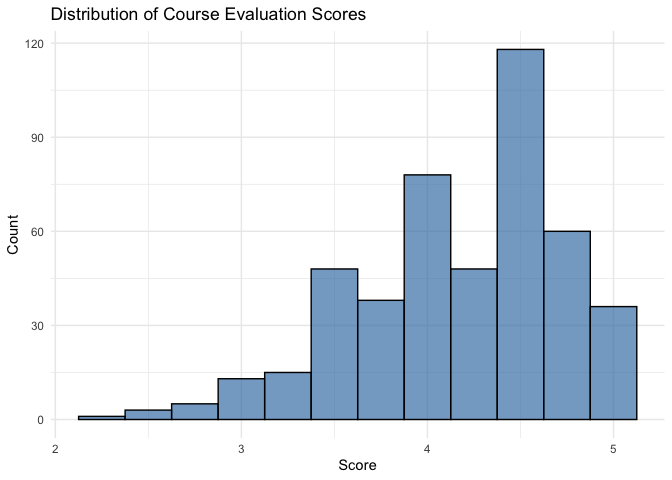
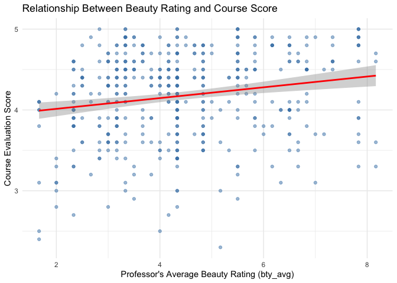
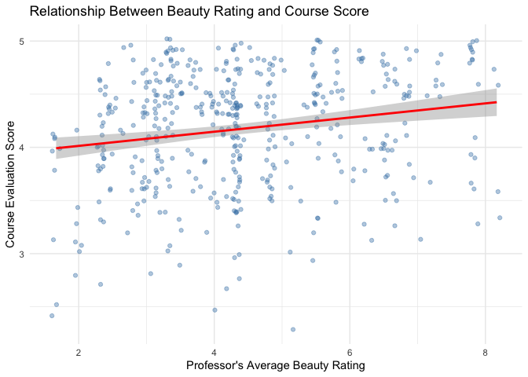
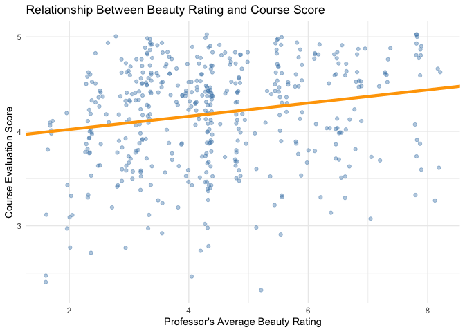

Lab 09 - Grading the professor, Pt. 1. Lab: Modeling professor
attractiveness and course evaluations
================
Yuxin Xie
3/5/25

## Load Packages and Data

``` r
#library(tidyverse) 
#library(tidymodels)
#library(openintro)

library(tidyverse)
library(broom)
library(openintro)
```

\##background info the use of these student evaluations as an indicator
of course quality and teaching effectiveness is often criticized because
these measures may reflect the influence of non-teaching related
characteristics, such as the physical appearance of the instructor. The
article titled, “Beauty in the classroom: instructors’ pulchritude and
putative pedagogical productivity” (Hamermesh and Parker, 2005) found
that instructors who are viewed to be better looking receive higher
instructional ratings.

The data were gathered from end of semester student evaluations for a
large sample of professors from the University of Texas at Austin. In
addition, six students rated the professors’ physical appearance. (This
is a slightly modified version of the original data set that was
released as part of the replication data for Data Analysis Using
Regression and Multilevel/Hierarchical Models (Gelman and Hill, 2007).)

The result is a data frame where each row contains a different course
and columns represent variables about the courses and professors.

The dataset we’ll be using is called evals from the openintro package.
Take a peek at the codebook with ?evals. 463 courses 23 variables.

## Exercise Part 1: Exploratory Data Analysis

``` r
data(evals)

summary(evals$score)
```

    ##    Min. 1st Qu.  Median    Mean 3rd Qu.    Max. 
    ##   2.300   3.800   4.300   4.175   4.600   5.000

``` r
ggplot(evals, aes(x = score)) +
  geom_histogram(binwidth = 0.25, fill = "steelblue", color = "black", alpha = 0.7) +
  labs(title = "Distribution of Course Evaluation Scores",
       x = "Score",
       y = "Count") +
  theme_minimal()
```

<!-- -->

``` r
#yes, the distribution is left skewed. This means most ratings are high, with a small number of lower ratings. 
# min is 2.3, max is 5, mean is 4.175, median is 4.3, mean<median, left skewed
# this is what i expected to see. because students tend to rate higher. 
```

``` r
# the relationship between score and the variable bty_avg, a professor’s average beauty rating.
ggplot(evals, aes(x = bty_avg, y = score)) +
  geom_point(alpha = 0.5, color = "steelblue") +  # Scatter points
  geom_smooth(method = "lm", color = "red", se = TRUE) +  # Regression line
  labs(title = "Relationship Between Beauty Rating and Course Score",
       x = "Professor's Average Beauty Rating (bty_avg)",
       y = "Course Evaluation Score") +
  theme_minimal()
```

    ## `geom_smooth()` using formula = 'y ~ x'

<!-- -->

``` r
#just by looking at it, there is a weak positive relationship between average beauty rating and score. 
```

``` r
#"The jitter geom is a convenient shortcut for geom_point(position = "jitter"). It adds a small amount of random variation to the location of each point."
#"is a useful way of handling overplotting"
ggplot(evals, aes(x = bty_avg, y = score)) +
  geom_jitter(alpha = 0.4, color = "steelblue") +  
  geom_smooth(method = "lm", color = "red", se = TRUE) + 
  labs(title = "Relationship Between Beauty Rating and Course Score",
       x = "Professor's Average Beauty Rating",
       y = "Course Evaluation Score") +
  theme_minimal()
```

    ## `geom_smooth()` using formula = 'y ~ x'

<!-- -->

``` r
##we can see that there are a lot of spots overlapping each other. 
##in the original graph, it is hard to tell the real density. 
```

## Exercise Part 2: Linear regression with a numerical predictor

``` r
#linear regression model 
m_bty<-lm(score~bty_avg, data=evals)
summary (m_bty)
```

    ## 
    ## Call:
    ## lm(formula = score ~ bty_avg, data = evals)
    ## 
    ## Residuals:
    ##     Min      1Q  Median      3Q     Max 
    ## -1.9246 -0.3690  0.1420  0.3977  0.9309 
    ## 
    ## Coefficients:
    ##             Estimate Std. Error t value Pr(>|t|)    
    ## (Intercept)  3.88034    0.07614   50.96  < 2e-16 ***
    ## bty_avg      0.06664    0.01629    4.09 5.08e-05 ***
    ## ---
    ## Signif. codes:  0 '***' 0.001 '**' 0.01 '*' 0.05 '.' 0.1 ' ' 1
    ## 
    ## Residual standard error: 0.5348 on 461 degrees of freedom
    ## Multiple R-squared:  0.03502,    Adjusted R-squared:  0.03293 
    ## F-statistic: 16.73 on 1 and 461 DF,  p-value: 5.083e-05

``` r
#the estimated intercept is 3.88, the estimated slope is 0.07

# score  = 0.07 bty_avg + 3.88
```

``` r
ggplot(evals, aes(x = bty_avg, y = score)) +
  geom_jitter(alpha = 0.4, color = "steelblue") +  
  geom_abline(intercept =3.88,slope = 0.07, color = "orange", linewidth = 1.5) + 
  labs(title = "Relationship Between Beauty Rating and Course Score",
       x = "Professor's Average Beauty Rating",
       y = "Course Evaluation Score") +
  theme_minimal()
```

<!-- -->

``` r
# score  = 0.07 bty_avg + 3.88
# the slope =0.07 means, when the average beauty rating inceases 1 unit, the rating score expected to increase 0.07 units. 
```

``` r
# score  = 0.07 bty_avg + 3.88
# the intercept = 3.88 means that when the average beauty score =0, the course rating score expected to be 3.88. In this case, a beauty rating of 0 is not realistic. 
```

``` r
summary(m_bty)$r.squared
```

    ## [1] 0.03502226

``` r
# the r squared is 0.035. that means bty_avg explains 3.5% of the variability in course evaluation scores. 96.5% of the course rating scores are due to some other factors. 
```

## Exercise Part 3

``` r
summary (evals$gender)
```

    ## female   male 
    ##    195    268

``` r
m_gen<-lm(score~gender, data=evals)
summary (m_gen)
```

    ## 
    ## Call:
    ## lm(formula = score ~ gender, data = evals)
    ## 
    ## Residuals:
    ##      Min       1Q   Median       3Q      Max 
    ## -1.83433 -0.36357  0.06567  0.40718  0.90718 
    ## 
    ## Coefficients:
    ##             Estimate Std. Error t value Pr(>|t|)    
    ## (Intercept)  4.09282    0.03867 105.852  < 2e-16 ***
    ## gendermale   0.14151    0.05082   2.784  0.00558 ** 
    ## ---
    ## Signif. codes:  0 '***' 0.001 '**' 0.01 '*' 0.05 '.' 0.1 ' ' 1
    ## 
    ## Residual standard error: 0.5399 on 461 degrees of freedom
    ## Multiple R-squared:  0.01654,    Adjusted R-squared:  0.01441 
    ## F-statistic: 7.753 on 1 and 461 DF,  p-value: 0.005583

``` r
#intercept 4.09
#slope 0.14 
# score  = 0.14 gendermale + 4.09
# on average, female professors receive a course evaluation score of 4.09.
# on avgerage, male professors (genderMale = 1) receive scores that are 0.14 points higher than female professors. 
```

``` r
# the predicted course evaluation score for female professors is 4.09.
# Equation for female professors: predicted score = 4.09
# the predicted course evaluation score for male professors is 4.23. 
# Equation for male professors: predicted score = 4.23
```

``` r
summary (evals$rank)
```

    ##     teaching tenure track      tenured 
    ##          102          108          253

``` r
m_rank<-lm(score~rank, data=evals)
summary (m_rank)
```

    ## 
    ## Call:
    ## lm(formula = score ~ rank, data = evals)
    ## 
    ## Residuals:
    ##     Min      1Q  Median      3Q     Max 
    ## -1.8546 -0.3391  0.1157  0.4305  0.8609 
    ## 
    ## Coefficients:
    ##                  Estimate Std. Error t value Pr(>|t|)    
    ## (Intercept)       4.28431    0.05365  79.853   <2e-16 ***
    ## ranktenure track -0.12968    0.07482  -1.733   0.0837 .  
    ## ranktenured      -0.14518    0.06355  -2.284   0.0228 *  
    ## ---
    ## Signif. codes:  0 '***' 0.001 '**' 0.01 '*' 0.05 '.' 0.1 ' ' 1
    ## 
    ## Residual standard error: 0.5419 on 460 degrees of freedom
    ## Multiple R-squared:  0.01163,    Adjusted R-squared:  0.007332 
    ## F-statistic: 2.706 on 2 and 460 DF,  p-value: 0.06786

``` r
#intercept 4.28
#slope for tenure track -0.13
#slope for tenured  -0.15 

# expected score  = -0.15 tenured + (-0.13) tenuretrack + 4.28

# on average, teaching professors receive a course evaluation score of 4.28.
# on avgerage, tenured professors have an expected evaluation score of 4.13.
# on avgerage, tenure-track professors have an expected evaluation score of 4.15.
```

``` r
#Create a new variable called rank_relevel where "tenure track" is the baseline level.
## Hint
#For Exercise 12, the `relevel()` function can be helpful!
rank_relevel<-relevel(evals$rank, ref = "tenure track")
```

``` r
m_rank_relevel<-lm(score~rank_relevel, data=evals)
summary (m_rank_relevel)
```

    ## 
    ## Call:
    ## lm(formula = score ~ rank_relevel, data = evals)
    ## 
    ## Residuals:
    ##     Min      1Q  Median      3Q     Max 
    ## -1.8546 -0.3391  0.1157  0.4305  0.8609 
    ## 
    ## Coefficients:
    ##                      Estimate Std. Error t value Pr(>|t|)    
    ## (Intercept)           4.15463    0.05214  79.680   <2e-16 ***
    ## rank_relevelteaching  0.12968    0.07482   1.733   0.0837 .  
    ## rank_releveltenured  -0.01550    0.06228  -0.249   0.8036    
    ## ---
    ## Signif. codes:  0 '***' 0.001 '**' 0.01 '*' 0.05 '.' 0.1 ' ' 1
    ## 
    ## Residual standard error: 0.5419 on 460 degrees of freedom
    ## Multiple R-squared:  0.01163,    Adjusted R-squared:  0.007332 
    ## F-statistic: 2.706 on 2 and 460 DF,  p-value: 0.06786

``` r
#intercept 4.15
#slope for teaching professor 0.13
#slope for tenured  -0.02 

# expected score  = -0.02 tenured + 0.13 teaching + 4.15

# on average, teaching professors receive a course evaluation score of 4.15+0.13=4.28.
# on avgerage, tenured professors have an expected evaluation score of 4.15-0.02=4.13.
# on avgerage, tenure-track professors have an expected evaluation score of 4.15.

summary(m_rank_relevel)$r.squared
```

    ## [1] 0.01162894

``` r
# r.squared = 0.01
# only 1% of the variability in course evaluation scores is explained by professor rank (tenured, teaching, tenure-track).
```

``` r
evals <- evals %>%
  mutate(tenure_eligible = ifelse(rank == "teaching", "no", "yes"))
```

``` r
m_tenure_eligible<-lm(score~tenure_eligible, data=evals)
summary (m_tenure_eligible)
```

    ## 
    ## Call:
    ## lm(formula = score ~ tenure_eligible, data = evals)
    ## 
    ## Residuals:
    ##     Min      1Q  Median      3Q     Max 
    ## -1.8438 -0.3438  0.1157  0.4360  0.8562 
    ## 
    ## Coefficients:
    ##                    Estimate Std. Error t value Pr(>|t|)    
    ## (Intercept)          4.2843     0.0536  79.934   <2e-16 ***
    ## tenure_eligibleyes  -0.1406     0.0607  -2.315    0.021 *  
    ## ---
    ## Signif. codes:  0 '***' 0.001 '**' 0.01 '*' 0.05 '.' 0.1 ' ' 1
    ## 
    ## Residual standard error: 0.5413 on 461 degrees of freedom
    ## Multiple R-squared:  0.0115, Adjusted R-squared:  0.009352 
    ## F-statistic: 5.361 on 1 and 461 DF,  p-value: 0.02103

``` r
#intercept 4.28
#slope for tenure_eligibleyes -0.14


# expected score  = -0.14 tenure_eligibleyes + 4.28

# on average, teaching professors receive a course evaluation score of 4.28.
# on avgerage, tenured and tenure tracking professors have an expected evaluation score of 4.28-0.14 = 4.14
# on average,the rating scores for teaching professors is 0.14 unit higher than for tenured and tenure tracking professors. 


summary(m_tenure_eligible)$r.squared
```

    ## [1] 0.01149589

``` r
# r.squared = 0.01
# Only 1% of the variability in course evaluation scores is explained by tenure eligibility.
```
